# Подробная схема кнопок RoleHub

Актуально для текущей реализации бота. Документ описывает точки входа, reply-кнопку активной комнаты, текстовые продолжения после кнопок и админские сценарии.

## Легенда

- `[...]` - экран или состояние пользователя.
- `reply-кнопка` - кнопка нижней клавиатуры Telegram.
- `/command` - текстовая команда.
- `текст пользователя` - следующий обычный текст, который обрабатывается через `pending_action`.
- `активный экран` - сообщение, помеченное как главный текущий экран; `/start` и `/clear` его не удаляют.
- `обычное сообщение` - сообщение, которое можно удалить через `/clear`.

## Общие точки входа

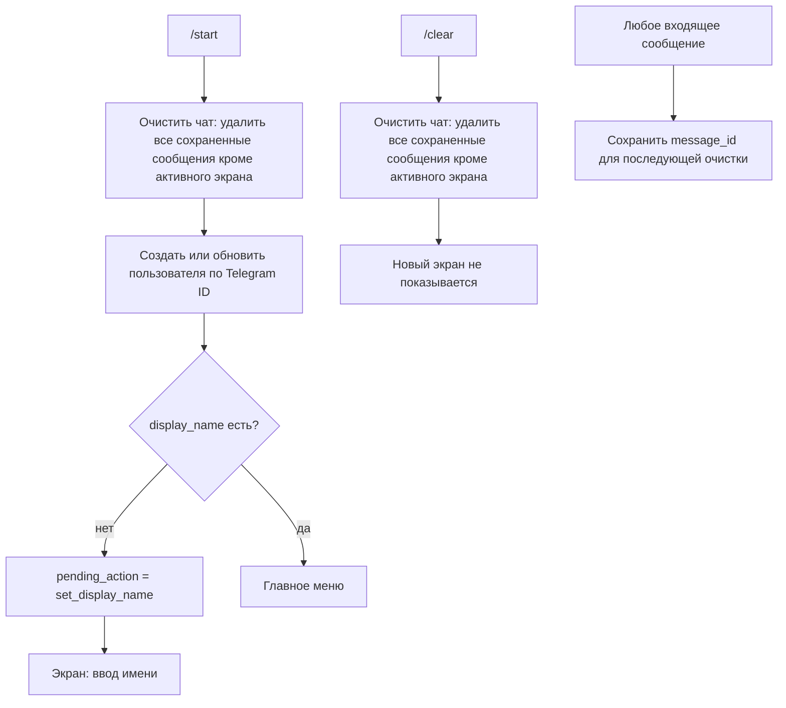

## Главное меню

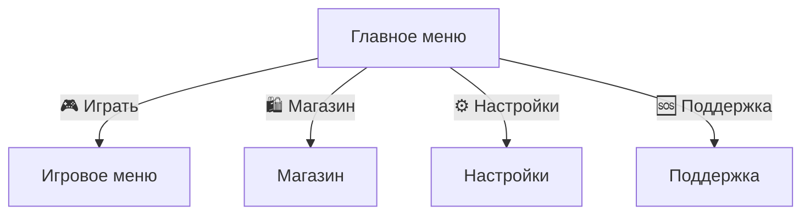

## Игровое меню

Текущий основной путь `menu:play` показывает новое lobby-меню, а не старый экран выбора темы.

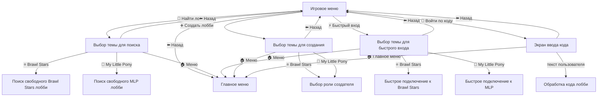

## Поиск лобби

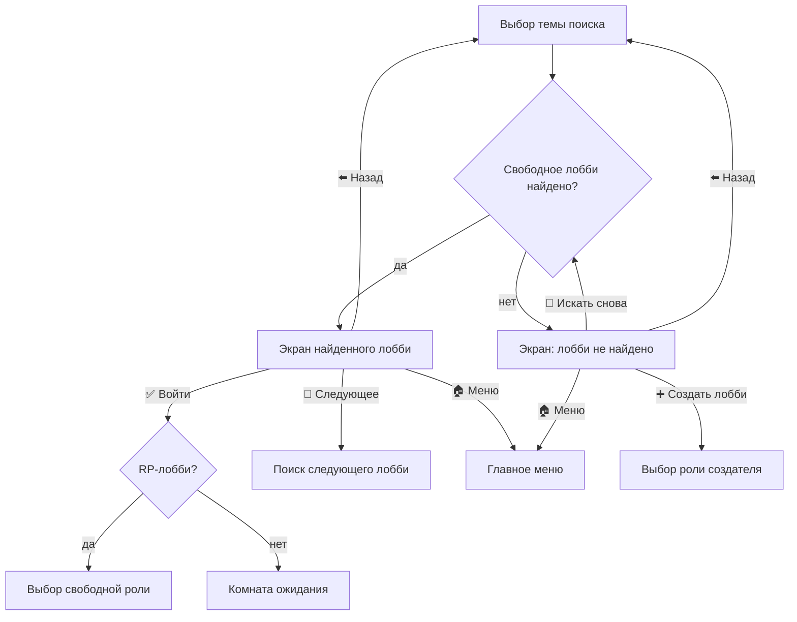

## Быстрый вход

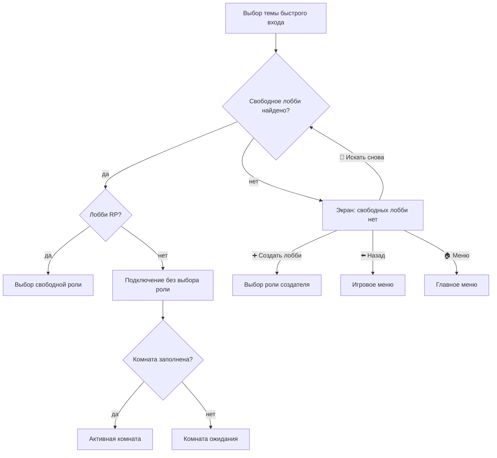

## Вход по коду

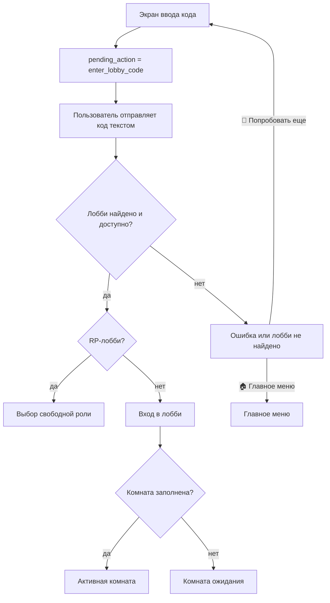

## Выбор роли при входе

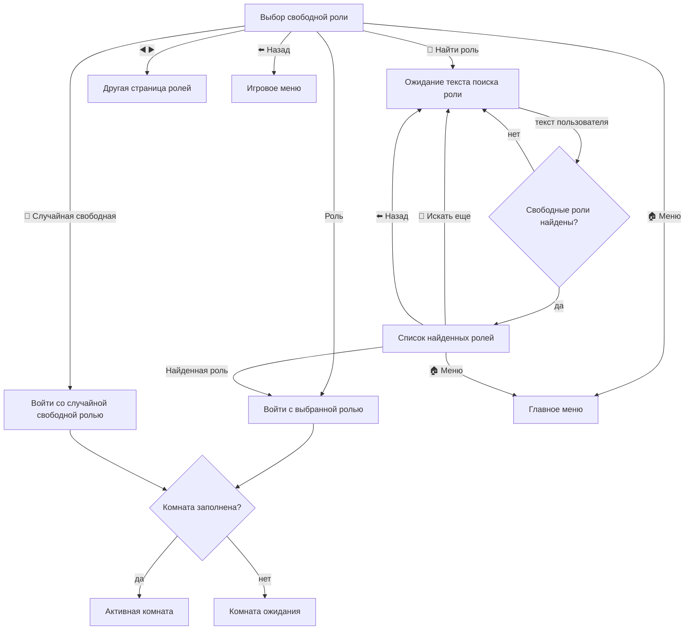

## Создание лобби

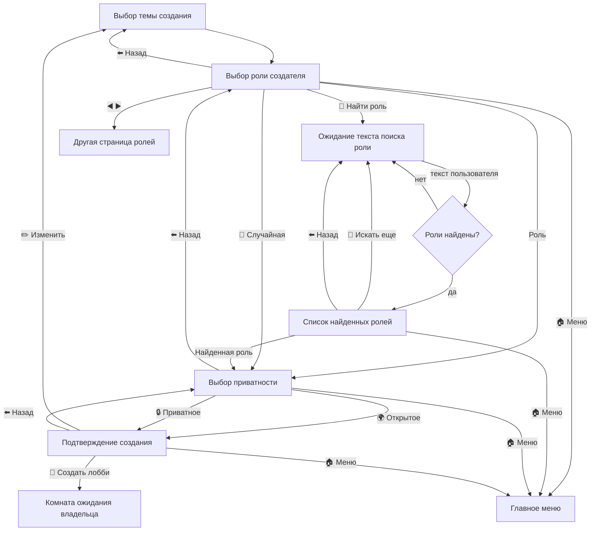

## Комната ожидания

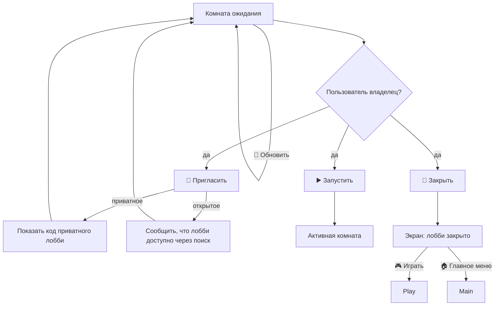

## Активная комната

В активной комнате есть две клавиатуры:

- reply-клавиатура активного экрана комнаты;
- нижняя reply-клавиатура пользователя с кнопками комнаты. Кнопки `/leave` нет, но команда `/leave` работает.

```mermaid
flowchart TD
    ActiveLobby["Активная комната"]

    ActiveLobby -->|"👥 Участники "| Members["Список участников"]
    ActiveLobby -->|"ℹ️ Инфо "| Info["Информация о лобби"]
    ActiveLobby --> OwnerClose{"Пользователь владелец?"}
    OwnerClose -- да -->|"🏁 Закрыть "| ClosedLobby["Экран: лобби закрыто"]

    Info -->|"👥 Участники "| Members
    Info --> OwnerCloseInfo{"Пользователь владелец?"}
    OwnerCloseInfo -- да -->|"🏁 Закрыть "| ClosedLobby

    Members -->|"⬅️ Назад "| Info

    ActiveLobby -->|"обычный текст/фото/стикер/voice"| RelayMessage["Переслать сообщение всем участникам активного лобби"]
```

## Ошибки и специальные lobby-состояния

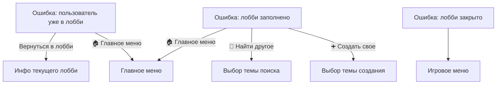

## Настройки

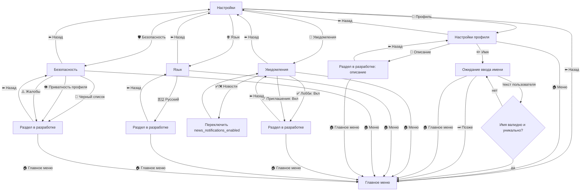

## Магазин

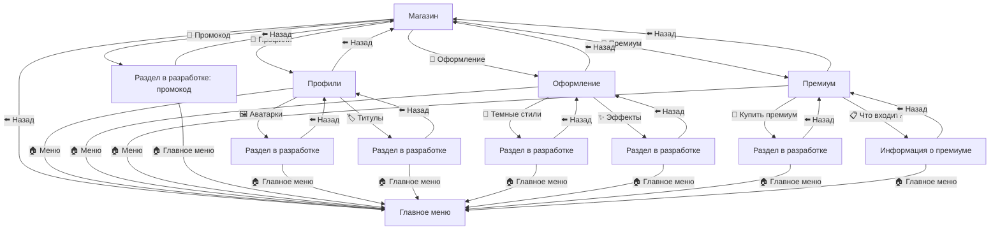

## Поддержка

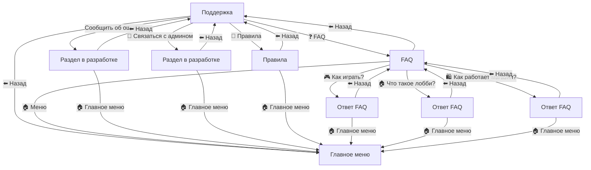

## Админ-панель

Доступ к `/admin`, `/users`, `/user`, `/stats`, `/export_users`, `/notify` проверяется по роли `users.role = "admin"` в базе данных.

Доступ к `/makeadmin` и `/removeadmin` проверяется только по `OWNER_IDS` из `.env`.

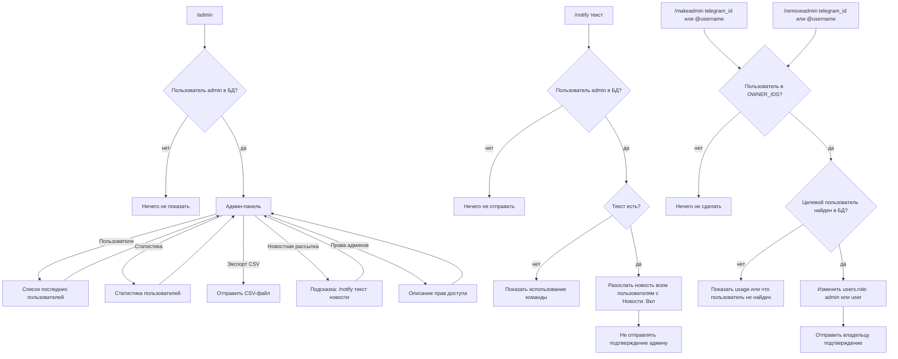

## Команды без reply-кнопок

| Команда | Кто может вызвать | Результат |
| --- | --- | --- |
| `/start` | любой пользователь | очищает чат кроме активного экрана, создает/обновляет пользователя, предлагает имя или показывает главное меню |
| `/clear` | любой пользователь | очищает сохраненные сообщения чата кроме активного экрана |
| `/admin` | admin в БД | показывает админ-панель |
| `/users` | admin в БД | показывает последних пользователей |
| `/user <telegram_id>` | admin в БД | показывает карточку пользователя |
| `/stats` | admin в БД | показывает статистику |
| `/export_users` | admin в БД | отправляет CSV с пользователями |
| `/notify <текст>` | admin в БД | рассылает новость пользователям с включенными новостями, без подтверждения отправки |
| `/makeadmin <telegram_id\|@username>` | owner из `.env` | меняет роль пользователя в БД на `admin` |
| `/removeadmin <telegram_id\|@username>` | owner из `.env` | меняет роль пользователя в БД на `user` |

## Текстовые продолжения после кнопок

| Откуда пользователь пришел | pending_action | Следующее сообщение пользователя |
| --- | --- | --- |
| `/start`, если имени нет | `set_display_name` | валидирует уникальное имя, сохраняет `display_name`, затем показывает главное меню |
| Настройки -> Профиль -> Имя | `set_display_name` | валидирует уникальное имя, сохраняет `display_name`, затем показывает главное меню |
| Играть -> Войти по коду | `enter_lobby_code` | ищет лобби по коду, затем предлагает роль или подключает к комнате |
| Создать лобби -> Найти роль | `create_role_search` | ищет роль внутри выбранной темы и показывает результаты |
| Войти в RP-лобби -> Найти роль | `join_role_search:CODE` | ищет свободную роль в конкретном лобби и показывает результаты |

## Особенности очистки и активного экрана

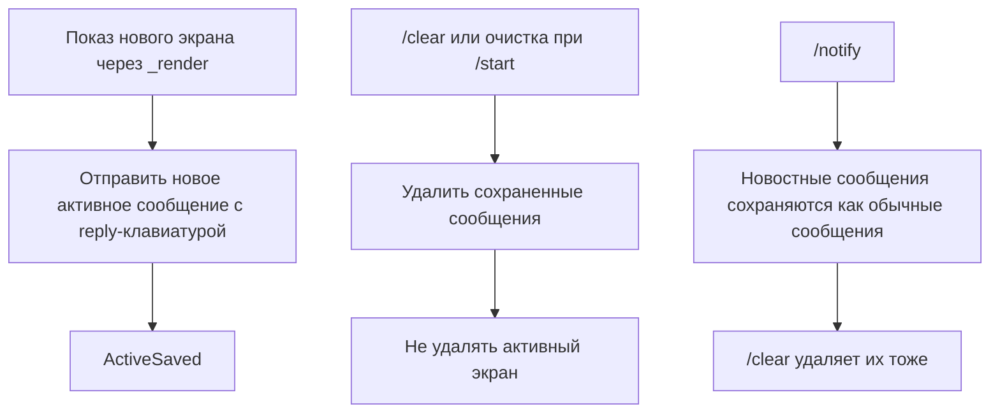
